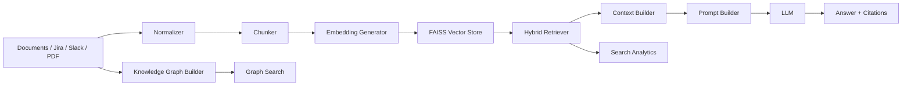

# EKDE Architecture

## High-level design

EKDE follows a classic enterprise RAG design:

1. Data sources are normalized and indexed.
2. Text is chunked and embedded.
3. Retrieval finds the best relevant chunks.
4. The graph layer adds relationship-based context.
5. The LLM answers using only the retrieved evidence.
6. The system records analytics and citations.

## Main components

### 1. Data ingestion

- Jira, PDF, meeting notes, and Slack exports are imported
- Each source is normalized into a standard document model
- Related metadata is stored alongside the source text

### 2. Search and retrieval

- Hybrid retrieval combines vector search and BM25 keyword matching
- Results are reranked for relevance
- The system explains which metadata and texts matched the query

### 3. Knowledge graph

- People, projects, technologies, tickets, and files become graph nodes
- Relationships are built between entities
- Graph search supports relationship-based queries such as:
  - Who worked with Neha?
  - Which projects use PostgreSQL?
  - Which team handles Kubernetes?

### 4. Prompting and chat

- Context is built from the top results
- A structured prompt is created with role, instructions, rules, and confidence policy
- The LLM answers only from retrieved context

### 5. Analytics and dashboards

- Search usage, confidence levels, response time, and source breakdown are recorded
- Admin APIs expose dashboard metrics for monitoring and demo use

## Data flow

## Core modules

- `backend/search/` — indexing, retrieval, ranking, graph search, formatters, citations
- `backend/chatbot/` — conversation flow, prompt templates, memory, session handling
- `backend/admin_api/` — analytics and dashboard endpoints
- `backend/ingestion/` — normalizer and source ingestion services
- `backend/documents/` — document model and persistence

## Design principles

- Evidence before answer
- Prefer authoritative sources
- Explain uncertainty instead of guessing
- Keep metadata rich for retrieval and graph linking
- Keep enterprise use cases front and center
