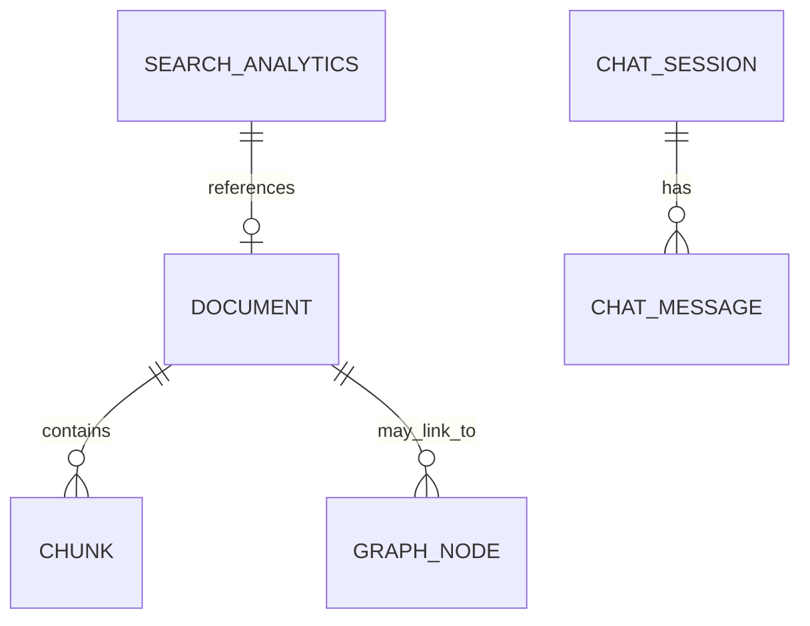

# Database and Data Model Design

## Core data model

### Document

Stores a normalized source item from any origin such as Jira, PDF, meeting notes, or Slack.

Key fields:

- id
- title
- source
- text
- metadata
- created_at

### Chunk

Stores segmented text that is used for retrieval and ranking.

Key fields:

- id
- document_id
- chunk_index
- text
- created_at

### SearchAnalytics

Stores every search event and related metadata.

Key fields:

- id
- query
- intent
- source
- confidence
- retrieved_chunks
- response_time
- created_at

### ChatSession

Tracks a conversation or session.

Key fields:

- id
- title
- created_at
- updated_at

### ChatMessage

Stores individual user or assistant messages.

Key fields:

- id
- session_id
- role
- content
- created_at

## Entity relationships

## Why this structure works

- Documents are the main source of truth.
- Chunks allow efficient retrieval and ranking.
- Search analytics helps measure success and quality.
- Chat sessions preserve user conversation context.
- Graph nodes connect people, tickets, projects, and technologies across sources.

## Future improvements

- Add explicit user manager and role tables
- Add document upload status tracking
- Add indexing job tracking
- Add graph node metadata and edge weights
- Add production database migration to PostgreSQL
